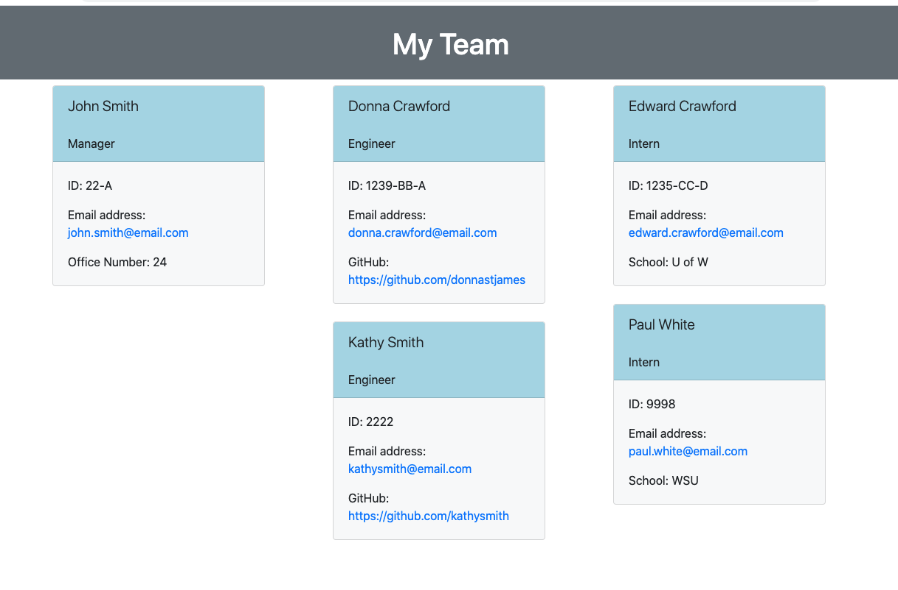

# Team Profile Generator

## Description
This is a NodeJS application that a manager can use to display information for each employee in the team.  The application is initiated using a Node.js command line which takes in the information and generates an HTML webpage that displays a summary for the Manager, Engineer(s) and Intern(s).  I developed a unit test for each individual class to ensure that all constructors and functions are working and maintainable.

## Installation
Install Node.js - https://nodejs.org/en/download/package-manager/ and `Jest` through `npm install`.

## Usage
Type the following from a terminal window:

```node index.js```

Type in the information for the `Manager`.  Once completed, follow the prompts and type in the information for an `Engineer` and/or `Intern` for however many apply. When this task is done, the application will generate an `index.html` which can be viewed on a webpage showing the summaries of each employee.

## Tests
Type the following from a terminal window:

```npm test```

## Languages
* HTML
* Javascript
* CSS
* Bootstrap - CSS framework

## Packages used
* Inquirer
* Jest

## Mock up

### Link to instructional videos
[Instructional video of application in use](https://drive.google.com/file/d/1PBp91UFJTrDMEB4LkvR__Y4YlQxygmPK/view)

[Instructional video of email and Github links working](https://drive.google.com/file/d/1JczNYjviOGbPltQ7oMR9ZDo12S9ZsVAZ/view)

### Link to sample HTML generated by the application
[Sample HTML](./index.html)


